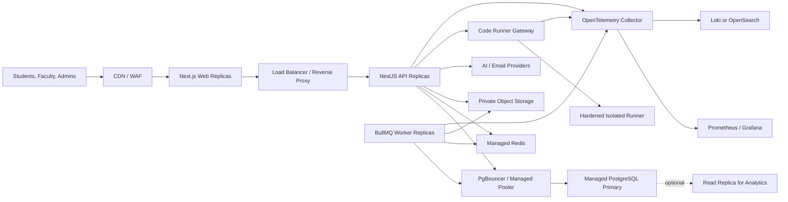

# Enterprise Architecture

CampusTest Pro Phase 17 defines a provider-neutral production target for web, API, workers, code-runner gateway, managed PostgreSQL, managed Redis, private object storage, observability, backups, and disaster recovery.

The API remains stateless. PostgreSQL is the source of truth for exams, attempts, submissions, results, audit records, and operational records. Redis is used for queues, rate limits, presence, heartbeats, and cache with TTLs; it must not store raw answers, hidden tests, credentials, or private evidence.

The code-runner gateway remains a control-plane boundary. Real untrusted execution belongs in a separate hardened runner with no data-plane access to PostgreSQL or Redis.
