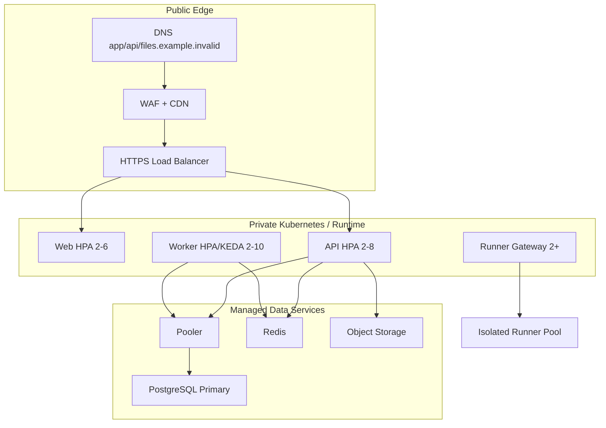

# Production Topology

Production should run at minimum:

- 2+ web replicas
- 2+ API replicas
- 2+ worker replicas
- 2+ code-runner gateway replicas
- managed PostgreSQL with backups and point-in-time recovery
- managed Redis with TLS/auth
- private object storage with versioning and retention
- WAF/CDN/load balancer
- centralized logs, metrics, traces, alerts

Production deployments use immutable image tags based on commit SHA and a single migration Job. Migrations must not run in every API replica.
