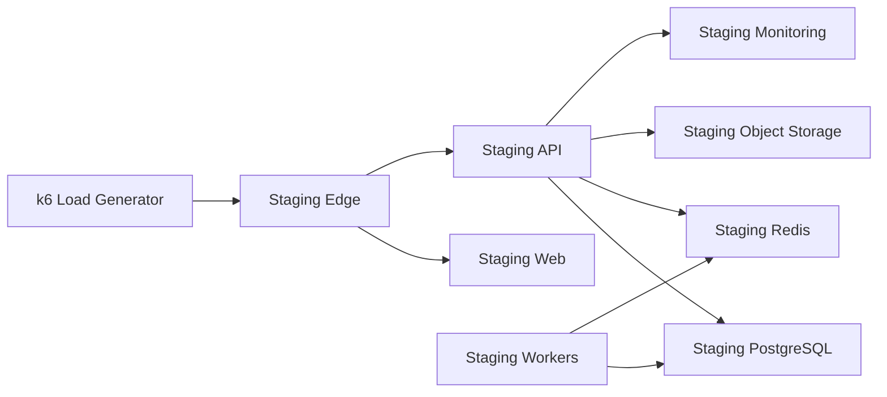

# Staging Topology

Staging mirrors production shape with smaller replica counts and non-production data. It is the only place where high-capacity load tests should run before any capacity claim.

Staging must use:

- separate database, Redis, object storage bucket, DNS, secrets, and OAuth/email credentials;
- production-like connection pooling and observability;
- synthetic users and assessments only;
- explicit cleanup for generated load-test data.

Do not run the 5,000-user profile locally. Use staging, controlled schedules, and documented results.
